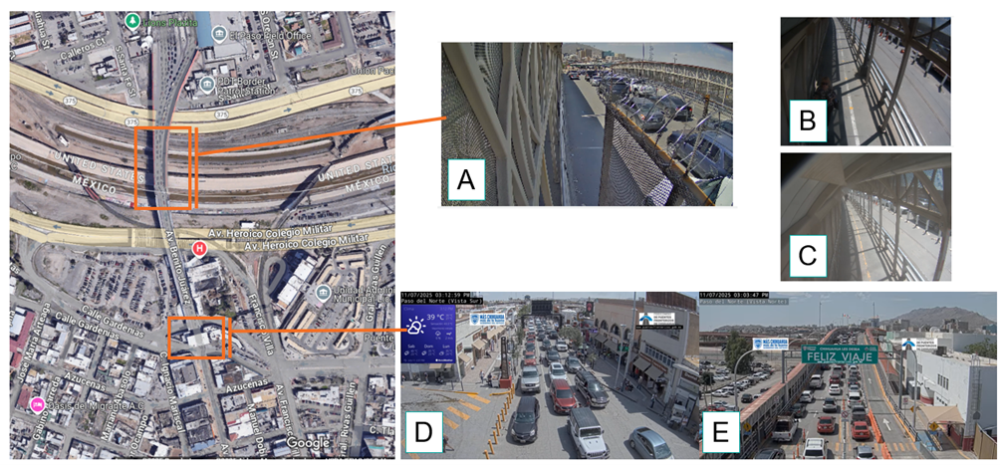
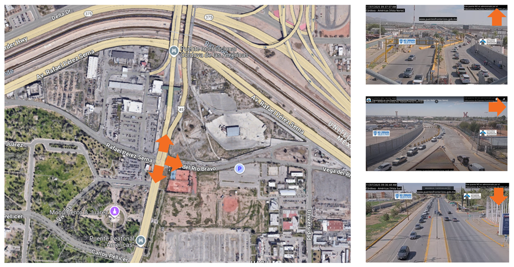
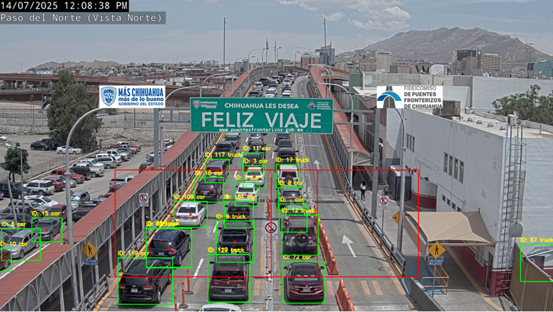
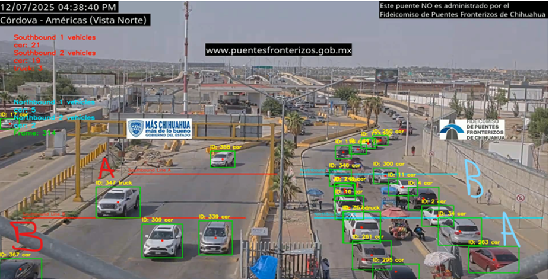

# README: U.S. DOT ROADII -- Estimating Border Wait Times
1. Project Description
2. Prerequisites
3. Usage
	* Building
	* Testing
	* Execution
4. Additional Notes
5. Version History and Retention
6. License
7. Contributing to the Code
8. Contact Information
9. Acknowledgements
10. README Version History

# 1. Project Description

### ROADII Background

Research, Operational, and Artificial Intelligence Data Integration Initiative (ROADII) is a multi-year initiative led by the United States Department of Transportation (U.S. DOT) Intelligent Transportation Systems Joint Program Office (ITS JPO).

ROADII’s vision is to expand U.S. transportation agencies’ (regional, state, local, tribal, etc.) access to advanced data analytics knowledge and resources including Artificial Intelligence (AI) and Machine Learning (ML). The ROADII team:
- Identifies and evaluates **use cases** that can benefit from advanced data analytics, AI, and ML
- Develops **proofs-of-concept** for use cases
- **Engages stakeholders** with proofs-of-concept and refine based on stakeholder feedback
- **Makes advanced data analytics, AI, and ML tools** available to the public at a central location (e.g., ITS CodeHub) 

The processes and tools developed under ROADII will enable data scientists, researchers, and data providers to test and share new transportation-related AI algorithms; to develop high-value and well-documented AI training datasets; to reduce the barriers of applying AI approaches to transportation data; and to train future transportation researchers.

For more information, visit ITS JPO's website [here](https://www.its.dot.gov/).

### ROADII Use Case - Border Wait Times

- **Full Title:** “Estimating Border Waiting and Crossing Times Using Real-Time Video Feeds” 
- **Purpose and goals of the project:** El Paso's six Ports of Entry (POEs) can experience major congestion, which impacts freight and personal vehicle travel. Wait times are provided on public websites but are not as accurate on lane-level wait time estimates. The border waiting and crossing times estimation prototype leverages video cameras deployed at the Paso Del Norte (PDN) and Bridge of the Americas (BOTA) borders. Due to the location of the cameras, the PDN border is placed to estimate crossing time, which is defined as the time from the booth on the Mexico side of the border through the time to reach the booth on the U.S. side. The BOTA cameras are placed at a greater distance from the booths, so these estimate the congestion levels leading up to the booth.

- **Purpose of the source code and how it relates to the overall goals of the project:** This code will employ use YOLOv11's object detection and tracking vehicles across video feeds. 

- **Length of the project:** October 2024 - July 2025.

**Paso Del Norte overview and video feeds:**
  

 

**Bridge of the Americas overview and video feeds:**
  

# 2. Prerequisites

Requires:
- Installation of Python 3.6.0 or later
- Installation of Python packages listed in *requirements.txt*

# 3. Usage

## YOLOv11 Object Detection
The model uses Ultralytics YOLOv11 for object detection and providing unique identifiers to vehicles across video feeds. Some tutorials on this process are available [here](https://www.youtube.com/watch?v=o8S28sLOUU8&t=73s) and here. 

## Paso Del Norte Crossing Time Estimation

  

The Paso Del Norte speed estimation method is implemented in the 'pdn_yt_feed_cv.ipynb' jupyter notebook. The script outputs a .csv file with metrics of the location and timestamps (relative to the beginning of hte computer vision analysis) of each id. That file is ingested in the 'pdn_cv_output_analysis.R' file to compute final metrics and some exploratory data visualization.

## Bridge of the Americas Speed Estimation

  
  
- Joe to add any usage notes specific to PDN

# 4. Additional Notes

**Known Issues:** None identified. 

# 5. Version History and Retention

**Status:** This project is complete. The code may be used for future video analytics work. 

**Release Frequency:** This project will be updated when there are stable developments.  

**Retention:** This project will likely remain publicly accessible indefinitely. 

# 6. License

This project is licensed under the Creative Commons 1.0 Universal (CC0 1.0) License - see the [License.md](https://github.com/usdot-jpo-codehub/codehub-readme-template/blob/master/LICENSE) file for more details. 

# 7. Contributing to the Code

Please read [Contributing.md](https://github.com/ITSJPO-TRIMS/R29-MobilityTrafficCounts/blob/main/Contributing.MD) for details on our Code of Conduct, the process for submitting pull requests to us, and how contributions will be released.

# 8. Contact Information

Contact Name: Eric Englin

Contact Information: Eric.Englin@dot.gov

### Citing this code

Users may cite our code base and/or associated publications. Below is a sample citation for the code base:

> ROADII Team. (2024). _ROADII README Template_ (0.1) [Source code]. Provided by ITS JPO through GitHub.com. Accessed yyyy-mm-dd from https://doi.org/xxx.xxx/xxxx.

When you copy or adapt from this code, please include the original URL you copied the source code from and date of retrieval as a comment in your code. Additional information on how to cite can be found in the [ITS CodeHub FAQ](https://its.dot.gov/code/#/faqs).

# 9. Acknowledgements

- Nineveh O'Connell (Volpe), Nineveh.OConnell@dot.gov
- Joseph Lynch (Volpe), Joseph.Lynch@dot.gov
- Billy Chupp (Volpe), William.Chupp@dot.gov
- Eric Englin (Volpe), Eric.Englin@dot.gov

This project is funded by the U.S. DOT, ITS JPO under IAA HWE3A122. Any opinions, findings, conclusions, or recommendations expressed in this material are those of the authors and do not necessarily reflect the views of the ITS JPO.

### Languages

- Python
- R (for data visualization)

### About

